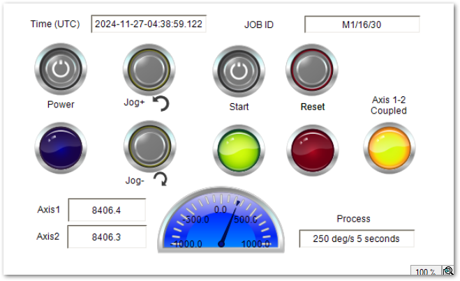

# ギアデモプロジェクト

本プロジェクトは、EL7211による2軸のコンパクトモーションにより電子ギアを用いて同期運転するデモ機のTwinCATプロジェクトです。

## 依存ライブラリ

|コンポネント|タイプ|バージョン|
|--|--|--|
|TwinCAT|XAE, XAR|4024.53|
|Tc2_MC2|ライブラリ|最新|
|JobManagementFramework|ライブラリ|1.0.0.1|

Tc2_MC2は [NC-PTP](https://infosys.beckhoff.com/content/1033/tcinfosys3/11503731467.html?id=4193766320347731994)を参照し、インストールを行ってください。

JobManagementFramework は、libraryフォルダ以下にあるライブラリをインストールする必要があります。[このサイトの手順](https://beckhoff-jp.github.io/TwinCATHowTo/library/use_library.html)でインストールしてください。

## 使い方



### デモ開始時

* 注意：
    PLC HMI（Visualization）は自動起動しません。トライアルライセンスで動作しますので、最初XAEからActive Configurationを行ってライセンスを有効にしてXARおよびVisualizationを起動させてください。

1. Powerボタンで2軸の電源をONにします。
2. JOG+ JOG- で下の歯車だけが1°のインチング回転します。上下の歯車の歯が重ならない位置に調整してください。
3. Startボタンを押すと、ボタンランプが点灯し、デモパターン動作を開始します。シーケンス終了後もStartボタンがONのままであれば繰り返し実施します。実行中は緑色のランプが点灯します。
4. もう一度Startボタンを押すと、ボタンランプは消灯し、デモシーケンスが終了した時点で停止します。シーケンス終了すると緑色のランプが消灯します。

* 注意：
    緑色のランプが点灯している間はPowerボタンを押さないでください。万が一押した場合は、再度XAEからActive Configurationを行ってモーションエラー状態を解除させる必要があります。

### エラーが発生したら

Resetボタンを押してリセットを試みてください。これで直らない場合は、XAEからActive Configurationを行って再起動してください。

### デモ終了時

1. Startボタンを押してボタンランプの消灯を確認し、デモシーケンスが終了するのを待ちます。
2. 緑色のランプが消灯したらPowerボタンを押してモータ電源をOFFします。
3. IPCをシャットダウンして電源を切ってください。

## デモプログラムパターンの改造

MAINプログラム以下のJobCreateDemoメソッドにジョブフレームワークによるジョブパターンが定義されています。POUsのactivitiesフォルダ以下にあるジョブフレームワークのジョブモデルを使ってジョブ生成します。

1. `Future***Creator` のインスタンスを生成し、この `set_parameter` や `set_option` を使って動作パラメータを設定する。
2. `base_job.children.create_job` の第一引数に、`Future***Creator` のインスタンスを、第二引数にジョブ名称を文字型で定義する。

上記を実行した順序でジョブは実行されます。必要に応じてオリジナルのデモパターンを定義してみてください。

## ジョブの実行状況表示

XAEのエラーメッセージウィンドウには、ジョブの実行状態が次の書式で出力されます。

    状態遷移時刻、イベント名、状態、エラーコード、ジョブコンテナであれば抱えているジョブ数、ジョブ名、ジョブID

以下のように出力されます。とくにモーション異常が発生すると、Err:の後にそのコードが出力されますので、原因追及にはこの値が必要となります。また、この際、実際モーションを制御するジョブの親のジョブは連動して停止するため、エラーコード 16#FFFFFFFF が出てabort状態となります。

```
Severity	Code	Description	Project	File	Line	Suppression State
Message		2024/11/27 14:59:51 942 ms | 'PlcTask' (350): 2024-11-27T06:59:51.942000+01:00	TRANSITION	finish	Err:0		SubJob:0		Name:Back to home		JobID:M1/21/2				
Message		2024/11/27 14:59:50 803 ms | 'PlcTask' (350): 2024-11-27T06:59:50.803000+01:00	TRANSITION	process	Err:0		SubJob:0		Name:Back to home		JobID:M1/21/2				
Message		2024/11/27 14:59:50 802 ms | 'PlcTask' (350): 2024-11-27T06:59:50.802000+01:00	TRANSITION	quit	Err:0		SubJob:20		Name:STEP MOVING		JobID:M1/21/1				
Message		2024/11/27 14:59:50 802 ms | 'PlcTask' (350): 2024-11-27T06:59:50.802000+01:00	TRANSITION	finish	Err:0		SubJob:20		Name:STEP MOVING		JobID:M1/21/1				
Message		2024/11/27 14:59:50 801 ms | 'PlcTask' (350): 2024-11-27T06:59:50.801000+01:00	TRANSITION	quit	Err:0		SubJob:0		Name:Wait 100ms		JobID:M1/21/1/20				
Message		2024/11/27 14:59:50 801 ms | 'PlcTask' (350): 2024-11-27T06:59:50.801000+01:00	TRANSITION	finish	Err:0		SubJob:0		Name:Wait 100ms		JobID:M1/21/1/20				
Message		2024/11/27 14:59:50 701 ms | 'PlcTask' (350): 2024-11-27T06:59:50.701000+01:00	TRANSITION	process	Err:0		SubJob:0		Name:Wait 100ms		JobID:M1/21/1/20				
Message		2024/11/27 14:59:50 700 ms | 'PlcTask' (350): 2024-11-27T06:59:50.700000+01:00	TRANSITION	quit	Err:0		SubJob:0		Name:Move +20 deg, 200 deg/s		JobID:M1/21/1/19				
Message		2024/11/27 14:59:50 700 ms | 'PlcTask' (350): 2024-11-27T06:59:50.700000+01:00	TRANSITION	finish	Err:0		SubJob:0		Name:Move +20 deg, 200 deg/s		JobID:M1/21/1/19				
```

また、HMIには、次の内容が表示されます。

|画面上の場所|表示名|内容|
|--|--|--|
|左上|Time(UTC)|UTC（国際標準時）におけるジョブ開始時刻|
|右上|JOB ID|ジョブID|
|右下|Process|ジョブ名称|
